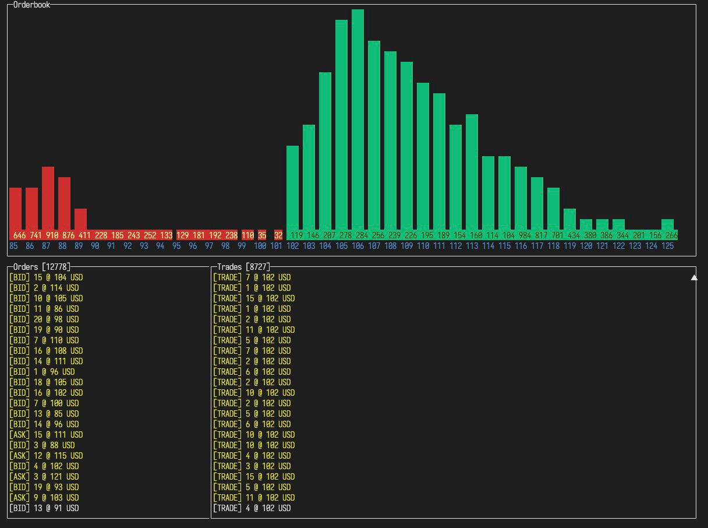

# go-orderbook

This is a library that implements an orderbook for traditional CEX type exchanges. Some features:

- Threadsafe via anonymous functions passed into channels
- Limit order processing:
  - Trades
  - Filled orders
  - Partially filled orders
- In-memory rollback functionality on error
- Ordered map to track prices
- Ordered map to track order queue for each price
- Simple public API
- Test suite
- Example with CLI UI
- Over 255,000 order adds per second



```
Running tool: /opt/homebrew/bin/go test -benchmem -run=^$ -bench ^BenchmarkOrderbook$ orderbook -v

goos: darwin
goarch: arm64
pkg: orderbook
BenchmarkOrderbook
BenchmarkOrderbook-8      255438              4667 ns/op            3536 B/op         52 allocs/op
PASS
ok      orderbook       2.641s
```
